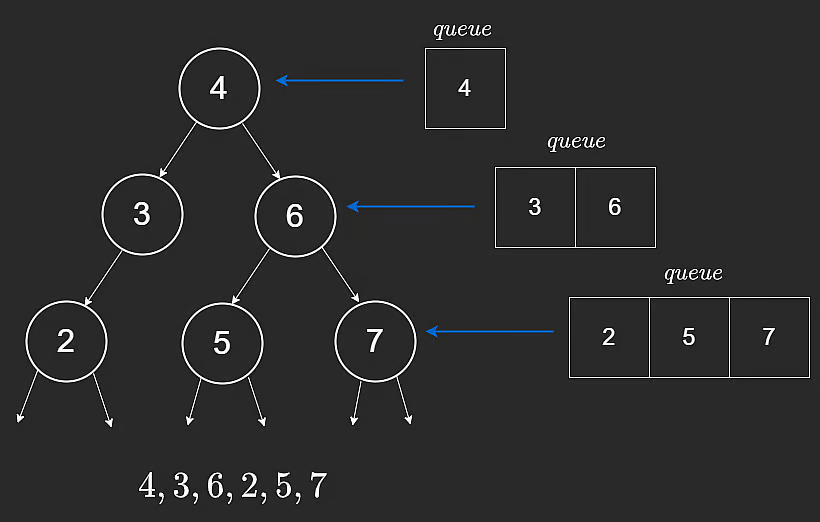

# Arrays
## Static Arrays
* A contiguous set of values
* `1 byte = 8 bits`
* Integer takes 32 bits of space, 4 bytes
* Characters take 8 bits of space, 1 byte

## Dynamic Arrays
Static arrays have to have a pre-defined size

* Pushing is an O(1) operation (adding a value)
* Popping is a O(1) operation (take a value from the end)
* When we run out of space, we need to copy original value to a new array, that's usually twice the size (memory space), which is O(n)
  * This is a middle ground between not having wasted space, and not always having to O(n)
* Because of the copying and doubling action, we know that for any array of size n, we will at most take 2n operations to create; thus O(2n) ~ O(n)
  * Because 1 -> 2 -> 4 -> 8; but the action before 8 is 1 + 2 + 4 = 7, which is smaller than 7
  * So at most it's n+n (8+8)
  * Thus at most we will take 2n operations
* Amortized time complexity is O(1) because it's pretty infrequent that we need to add more space
* Inserting or removing in the middle is still O(n)


## Stacks
Last in first out (LIFO).

* Push (O(1))
* Pop (O(1))
* Peek/Top (O(1))

Since the out order is reverse of the in order, it can be used to **reverse sequences**, such a s a string.

# Linked Lists
## Singly Linked Lists
* A `ListNode` will need to have `value` and `next` (a pointer)
* We point `next` to another `ListNode`
* Unlike arrays where they values are stored in the same order in memory, a linked list doesn't need to be saved in the same order in memory
* Normally we will keep a pointer to always point at the Head and the Tail of a linked list
* Adding to beginning or end is O(1)
* If you have a reference to a node in the middle it will be O(1)
* But if we need to "search" for an element it will be O(n)
* To access a random element without a specific pointer to it, it will also be O(n)
* To remove a node at the end, it will be O(n) because we need to traverse from `head` to know who precedes `tail`
* (for array it is always O(n) because we have to copy over the remainder)

### Linked List Traversal
```python
cur = ListNode1
while cur:
    cur = cur.next
```
This take O(n)

We usually will keep a `head` and a `tail` pointer.


## Doubly Linked Lists
We have double pointers. `next` and `prev`

### Appending a new node
To append a new node
```
tail.next = NewNode
NewNode.prev = tail
tail = tail.next
```

### Deleting from the tail
Compared to a singly linked list, removing the last node can be done at O(1), because we don't have to traverse from `head` to the end to know who precedes `tail`

```
node2 = tail.prev
node2.next = null
tail = node2
```

* So deleting a node at the end is O(1), which means that both append and remove from the end is O(1), so we satisfy a `stack` requirement
* But unlike a stack, we can't access a random element at O(1), instead we still need to traverse at O(n); so we don't implement `stack`'s using doubly linked lists

### Array vs Linked List
||Arrays|LinkedLists
|---|---|---|
|Access i-th element|O(1)|O(n)|
|Insert Remove end|O(1)|O(1)|
|Insert/Remove middle|O(n)|O(1)*|

*for us to remove in the middle, we have to arrive at that point, which still would take O(n) anyway

So overall, **arrays are still better for most cases because the advantage in insert/remove is handicapped by the O(n) of i-th element access anyway**

## Dummy Nodes
* Dummy nodes are useful whenever we are doing manipulations to a linked lists where we might run into `Null` edge cases
* It allows all real nodes to always have a valid `next` and `prev` pointers
  * If singly linked only, then we only need `next` pointer
  * So only dummy head is needed; dummy tail not needed (but we will point tail to dummy head at init)
  * Conversely if it's a doubly linked list, then dummy tail is needed and dummy head should be linked to dummy tail at init
* Since every node will always have a valid `next` and `prev` pointers, we won't need to build out special edges cases for the 0th and (n-1)th index


## Queues
* Differ from a stack in that it's FIFO
The main requirement is enqueue and dequeue both need to be O(1)

This can be achieved with linked lists.

Could be done with arrays too, but you would need to shift data as we enqueue and dequeue so that would take O(n)

# Recursion
Recursion calls itself until a base case is reached.
## Factorial (single branch)
* Recursive solution - think of factorial's definition, and the base case definition.
```python
def factorial(n):
    if n == 1:
        return 1
    return n * factorial(n - 1)
```
* Complexity
  * O(n) in time
  * O(n) in space (each function call needs its memory to put the function on hold)

* Iterative solution
```python
def factorial(n):
    res = 1
    for i in range(1, n+1, 1):
        res *= i
    return res
```
* Complexity
    * O(n) in time
    * O(1) in space

## Fibonacci Sequence (two branches)
```python
def fibonacci(n):
    if n <= 1:
        return 1
    return fibonacci(n - 1) + fibonacci(n - 2)
```
Since from the top each node splits into 2, we need to do 2 * 2 * 2 * ... operations. And the depth is at most from n all the way down to 1/0, in decrement of 1. Therefore the depth is at most n, thus the time complexity is O($2^n$)
```
        [ 5 ]
         /    \
      [4]     [3]
      /\        /\
  [3] [2]     [2] [1]
  /\    /\     /\
[2][1] [1][0] [1][0]
/\
[1][0]
```
* Complexity
  * O($2^n$) in time
    * Because at each layer there are twice more calls
  * O(n) in space
    * Because it's determined by the deepest point of the recursion, and the maximum stack depth is just n


# Sorting
|Algorithms|Time Complexity|Space Complexity
|---|---|---|
|InsertionSort (stable) |$O(n^2)$|$O(1)$|
|MergeSort (stable) |$O(n\log{n})$|$O(n)$|
|QuickSort (unstable) |$O(n\log{n})$ to $O(n^2)$|$O(1)$|
|BucketSort (unstable) |$O(n)$|$O(1)$|

## Insertion Sort
* **How it works**:
  * Like a window function
  * First start from just itself - by definition it's already sorted
  * Then a window of two, is the last smaller than its previous one? Swap, and step to previous index
  * Continue...
  * We will always check until we either
    * Hit the first position
    * Comparison has failed (i.e. the previous number indeed is smaller)
* **Time Complexity**
  * $O(n^2)$ in the worst case and $O(n)$ in the best case
  * Because the number of operations goes like 1 -> 2 -> 3 -> 4, to summing them all, it's equal to a half a square, so we are bounded by $\frac{n^2}{2}$, so we get $O(n^2)$
* **Space Complexity**
  * O(1) because no additional structure is used
* **Stability**: It is stable because if there is a tie, the original relative position will be preserved (because nothing gets moved when it's a tie)

## Merge Sort
* **How it works**:
  * Break by sub-problems by half, until we reach just two individual sub-problems each with a length 1
  * We then merge back up and individually compare the size by using two pointers iterating through each sub list
  * Since we are halving each time, the total "depth" will be $\log{n}$
  * At each layer, we will need to compare n numbers because each element will be iterated over once
* **Time Complexity**
  * $O(n\log{n})$
  * Because there is a depth of $log(n)$ as we recursively split the array in half,
  * and at each layer the merging act itself will take at worst $O(n)$ time as we iterate through the two left and right sub-arrays
* **Space Complexity**
  * $O(\log(n) + n) = O(n)$
  * Because log(n) memory stack, then we need to copy the sub-arrays at each merge step, which in total will take up n in space
* **Stability**: Stable

## Quick Sort
* **How it works**:
  * We pick a pivot value (naively, we just pick the last value)
  * Then we start two pointers at the first position in the sub-array that's left to it
  * One pointer will be noting, if we find a value that's less than the pivot value, this is the position that we are going to put the smaller value in
  * The other pointer is just iterating to the right until we hit the pivot value
  * Is this value less than the pivot value? If yes, we swap to the first pointer; we then advance both the first and second pointer
  * If this value is not less than the pivot value, we do nothing, and only advance the second pointer
  * Lastly, we then put the pivot value into the position of the first pointer
* **Time Complexity**
  * $O(n\log{n})$ on average because we would have a depth of $log(n)$ from the splits, and at each layer we need to at worst compare n values
* **Space Complexity**
  * $O(1)$ because all modifications are done in place
* **Stability**:
  * When there is a tie, the ordering isn't guaranteed


## Bucket Sort
* **How it works**:
  * Iterate over the array once, and count how many times each unique value appear
  * Then simply replace the original arrays based on how many times each unique value has appeared (do it in order, of course)
* **Time Complexity**
  * $O(n)$ (really it's $2n$) because we iterate once to count how many times values appear
  * Then another iteration to replace the values
* **Space Complexity**
  * $O(k)$ where $k$ is the number of unique values
* **Stability**
  * No
  * We just count how many times a value appear
  * We then replace the array based on how many times a value appear
  * The ordering is entirely irrelevant

# Binary Search
## Practical Implementation
```python
l, r = 0, len(array) - 1
while l <= r:
    mid = (l + r) // 2
```
## Search Array
* Works if an array is already sorted
* We would calculate the mid point, and see if the target value is greater or smaller, we then search either the right or left
* This makes our search time only $O(\log{n})$ since the depth is $2^x = n$ so $x = log(n)$ is the depth
* It's also possible that the value is simply not in the array, in which case we would just have `L`, `R`, and `mid` all pointing at the same element
* When `L` finally becomes bigger than `R`, that's how we know the element doesn't exist (because even the last pointer itself isn't equal), and we can exit the loop

## Search Range
* When ask to search in a range, especially when given some arbitrary function to determine eligibility, this is typically a binary search problem
* By always going to the mid point we divide and conquer, and will be able to reach a worse case of $\log{n}$, instead of needing to traverse through all eligible numbers


# Trees
## Binary Tree
* A hierarchical data structure where each node has at most two children, typically referred to as the left child and the right child.
* Will always have leaf nodes, which are nodes with no children
* Can't have cycles
* Sharing the same parent means they are sibling nodes
* Height: the longest path to a descendant leaf node from this current node
* Depth is the longest path to the root
```python
class TreeNode:
    def __init__(self, val):
        self.val = val
        self.left = None
        self.right = None
```
## Binary Search Trees (BST)
### Time complexity
|Operation|Time|
|---|---|
|Search|$O(\log{n})$|
|Insert|$O(\log{n})$|
|Delete|$O(\log{n})$|

### Definition
* All nodes in the left subtree have to be less than their root node
  * (generally binary search trees do not have duplicates)
* This property has to hold for every single node/subtree
* Search Time Complexity: $O(\log{n})$ for a balanced tree (left and right height subtrees always have equal height or at most a diff of 1)
* But strictly it's $O(h)$ where $h$ is the height of the tree
* Main advantage over sorted arrays: *insertion and deletion is done in $O(\log{n})$ instead of $O(n)$*


## BST Insert and Remove
(tree linkage is done via recursion, where the `.right`/`.left` gets pointed to the next recursive call, and we return backwards once we reached a base case, and linkage gets created backwards from leaf back to the root)

### BST Insert
* We have to traverse the tree to find the right position
* We can recursively call insert on each child node until we reach a null
```python
def insert(root, val):
    if not root:
        return TreeNode(val)

    if val > root.val:
        root.right = insert(root.right, val)
    elif val < root.val:
        root.left = insert(root.left, val)
    return root
```
* **Time Complexity**
  * $O(h)$ because we still have to traverse the height of the tree
* **Space Complexity**
  * $O(h)$ for the amount of recursive call stack

### BST Remove
* We first have to search where the target value is, which can take $O(h)$ to do
* Once we found the matched node, we have either of these scenario
  * Case 1: The node to be deleted only has 0 or 1 child
    * Just link the parent to whichever surviving child is
    * We can achieve this by returning the surviving child
  * Case 2: The node to be deleted has 2 children
    * Find the smallest leaf node of the right subtree
    * Take that minimum node to now replace this to be deleted node
    * This way we ensure that all values on the right of this newly replaced node will be greater
    * We can do this replacement in-place, then the leftover work is to find this value in the right sub-tree and remove it
    * Which can be achieved by another recursive call on the right sub-tree with this value as the target value

```python
def minValueNode(root):
    while root:
        root = root.next
    return root


def remove(root, val):
    if not root:
        return None
    if val > root.val:
        root.right = remove(root.right, val)
    elif val < root.val:
        root.left = remove(root.left, val)
    else:
        if not root.right:
            return root.left  # so the previous call's child gets set to this node
        elif not root.left:
            return root.right
        else:  #  has two children, need to find the minimum value
            min_node = minValueNode(root.right)
            root.val = min_node.val
            root.right = remove(root.right, root.val)
    return root
```

* **Time Complexity**
  * $O(2h)$ because
    * We have to first traverse the tree to find the target node, which can be anywhere from the root to the leaf level of the tree
    * We then have to traverse the right sub-tree to find the minimum value of this right sub-tree
    * These two steps would then sum to the full height
    * But we also have to go to the right subtree to remove this minimum value, so that could at most be another $h$ to traverse
    * So in total this is $O(2h)$


## Depth-First Search
* This is a recursive algorithm by nature
* The key definition here is that we go as far deep into the leaf first before we start backtracking
* The different "order" traversals are just about when the current node gets processed relative to its subtrees

### In order traversal
```python
self.traverse(root)
print(root)
self.traverse(root)
```
* In order traversal means that we go depth first
  * We go as left as possible -> record the current leaf node -> go to the parent -> go traverse the right sub-tree
* Useful for printing in ascending order

### Pre order traversal
```python
print(root)
self.traverse(root)
self.traverse(root)
```
* Useful for serializing a tree structure since it visits the parent before children nodes

### Post order traversal
```python
self.traverse(root)
self.traverse(root)
print(root)
```
* Useful for deleting a tree because it visits children before parents


## Breadth-First Search
* We visit based on layers
* Usually implemented iteratively, and uses a queue
```python
from collections import deque

def bfs(root):
    queue = deque()
    if root:
        queue.append(root)

    while queue:
        for i in range(len(queue)):  # this is how many nodes that are in this level
            curr = queue.popleft()
            print(curr.val)
            if curr.left:
                queue.append(curr.left)
            if curr.right:
                queue.append(curr.right)
```


* **Time Complexity**
  * O(n) because we visit each node once
* **Space Complexity**
  * O(n) we will be storing the entire level in a queue at once
    * This would occur at the leaf node level, which for a balanced tree is of width $\frac{n+1}{2}$ (because the number of nodes doubles at every level)


## BST Sets and Maps
* For sets and maps (sorted), the most common implementation is just a binary-search-tree
* This way we can achieve the following in $O(\log{n})$
  * Insert
  * Delete
  * Search
  * (because you still have to traverse in order to insert and delete at the right places so takes $O(\log{n})$)

### Sets
* The values are sorted
* Using a `TreeSet` allows us to achieve the above properties

### Maps
* Key-value pair
* If using tree to implemented a sorted map, it's called a `TreeMap`

# Backtracking
It's mostly for cases where we want to have a a comprehensive traversal of all solutions.

Maintain a solution stack. Keep adding solution to it. If an invalid solution is found, we pop from the stack, and go back to the previous step.

## Tree Maze
### No memory version
* Given a binary tree (not a binary search tree), find if a path to a leaf node can be found where a `0` is never encountered
```python
class TreeNode:
    def __init__(self, val):
        self.val = val
        self.left = None
        self.right = None

def canReachLeaf(root):
    if not root or root.val == 0:  # base case
        return False

    if not root.left and not root.right:  # this is a leaf node
        return True
    if canReachLeaf(root.left):  # explore left subtree
        return True
    if canReachLeaf(root.right):  # explore right subtree
        return True
    return False
```
* If the left subtree returns `True`, we can return `True`
* If the left subtree returns `False`, we can explore the right subtree
* If the right subtree returns `True`, we can return `True`
* If both left and right subtree returns `False`, then we can return `False`
### With memory of path version
```
def leafPath(root, path):
    if not root or root.val == 0:
        return False
    path.append(root.val)  # it passed the base case, so we can add it to path

    if not root.left and not root.right:  # this is a leaf node, so we pass
        return True
    if leafPath(root.left, path):  # if left subtree is valid, so we pass
        return True
    if leafPath(root.right, path):  # if right subtree is valid, so we pass
        return True

    path.pop()  # if we get to this step, that means all of the above three cases failed, so this is not a valid path, we must remove it
    return

```
*
## Time Complexity
* $O(n)$ because in the worst case we visit every single node
## Space Complexity
* $O(h)$ because the recursion stack can be at most as deep as the height of the tree. And the stored path will at most have `h` elements as well


# Heap / Priority Queue
## Heap Properties
* For a priority queue want to be able to find min or max value really quickly
  * Instead of first in first out, we remove values based on a specific priority
* This is usually implemented with a heap
* A heap is a specialized tree-based data structure
  * For a min heap, the smallest value is at the root node
  * For a max heap, the largest value is at the root node

### Structure Property
* TL;DR: Full at every level except the last layer, and root has to be min or max
  * Must be a complete binary tree
  * Every level must be filled, except for the lowest level, which needs to be filled from left to right with no gap

### Order Property
* All descendants should be greater than their ancestors (for a min-heap)

## Heap Implementation
* Under the hood it's implemented with a dynamic array of size $n + 1$
* We don't use index 0, instead start the root at index 1
* We then fill the array contiguously in a breadth-first manner
* Then the children of a node can always be found with the following formula:
```
leftChild = heap[2 * i]
rightChld = heap[2* i + 1]
parent = heap[i // 2]  # we round down
```

In code this translates to
```python
class Heap:
    def __init__(self):
        self.heap = [0]
```

## Push and Pop
[code pointer](../code/heap/heap.py#L25)
|Operation|Time|
|---|---|
|view min max|$O(1)$|
|push|$O(\log{n})$|
|pop|$O(\log{n})$|
|heapify|$O(n)$|
### Push
* We append the new value to our heap dynamic array
* Then we bubble up, and check if this new value is smaller than the parent, and swap if so
* Once we reach a position where there's no swap, we know that the ordering property is satisfied (or root is reached)

### Pop
* We first save the minimum value because that needs to be returned later
* Then we swap with the root value, so structure property is satisfied
* Then we bubble down and swap with the smallest of its two direct children

## Heapify
### Description
* It turns a regular array into a heap
### How it works
* It works by first going to the first node that doesn't have any children
* Then we check whether the current node is smaller than the two children
  * If it is smaller, move up
  * If it is not smaller, then we exchange with the smallest of the two children, then bubble down again to make sure the subtree still satisfies the heap ordering property
* We continue doing this until we've reached the top root node
### Time Complexity
* $O(n)$
* Starting from the first level where there is at least one non-leaf nodes, we need to go through every node in this level
* Every time we go up a level, the number of nodes decrease by half
* But then the number of levels we need to percolate down also increase
* The sum nicely sums to roughly $O(n)$
### Using heaps to sort
* We can build an array into a heap in $O(n)$
* We can then pop elements one by one to build into a sorted array
* Since each pop action takes $O(\log{n})$, the total time complexity is $O(n\log{n})$
* Note that for general searching, we still have to search through the whole heap, so time is $O(n)$
  * This is because say the target value is larger  ent root of a min heap
  * We don't know if the target is going to be in left or right subtree


# Hashing
## Hash Usage
### General Description
Hash maps are useful for quickly accessing unique counts.

Note that the difference between a set and a map is that sets contains keys only. Maps contain key-value pairs.

### Time Complexity
| Operation | TreeMap | HashMap | Array |
| --- | --- | --- | --- |
|Insert | $O(\log{n})$ | $O(1)$ | $O(n)$ |
|Remove | $O(\log{n})$ | $O(1)$ | $O(n)$ |
|Search| $O(\log{n})$ | $O(1)$ | $O(\log{n})$, if sorted |
|Inorder Traversal | $O(n)$ | - | - |

Note that for hash map this is technically the average case, not the worst case.

### Tree Maps vs Hash Maps
* The main downside of hash maps is that its not sorted
* If we were to traverse the keys in order, we would have to sort the keys first
* Sorting the keys would take $O(n\log{n})$ in total time, just based on the common sorting algorithm's time complexity

## Hash Implementation
Most hash maps are implemented using arrays under the hood.

We will use a hash function that takes a key and convert it into an integer.

The integer will be the index that stores the key-value pair in the array.

### Time Complexity
|Operation | Time |
| --- | --- |
| Insert | O(1) |
| Remove | O(1) |
| Search | O(1) |

These are only true on average, and assuming we have a good hash function and low number of collisions.

In the worst case, time complexity could be $O(n)$

### Insertion and Hashing
A simple example is to convert each character of the string into its ASCII code and sum them up (this is the pre-hash step).

Since this sum will likely be larger than the underlying array size, we **modulo by the size of the array** to avoid going over bound, thus producing a hash

Now if the hash lead to a location that's occupied by a key-value pair, then this is called a collision

### Resizing
We will keep track of the **size of the array** and the number of **non-empty elements**.

When the array becomes half full, we double the size of the array, in order to reduce the chances of collisions.

This will be done at the moment that half full is reached, before the next insertion is performed.

(a better way is to increase the size of the array to the next prime number)


### Rehashing
Once the resize is performed, the existing key-value pairs' new index position needs to be recalculated.

So for example, we need to re-perform `sum(ASCII codes) % new_capacity`

### Collisions
If two keys map to the same position (i.e. `33 % 8 = 1` but `49 % 8 = 1` also)

Two common solutions are:

1. Chaining - keep at the same location, but use a linked list to store the subsequent new key-value pairs
   a. While if all key-value pairs end up at the same position the time complexity would be $O(n)$, the average time complexity is still O(1)
2. Open Addressing - we just keep iterating to the next elements until we hit a non-null value
   a. This also means that when we look up a key, if at the current index the key doesn't match, we have to continue going to the next element to see if the key match
   b. Because when inserting, maybe a collision occurred so the key was pushed to a later element
   c. We have to do this iteration until a Null element is reached, then we know the key doesn't exist

#### Open Addressing vs Chaining
Open Addressing Pros:
* More efficient if there are a small number of collisions
Open Addressing Cons:
* Number of entries to the map is limited by the size of the array
* Harder to implement compared to chaining

# Graphs
## Intro to Graphs
### Graph Terminology
The number of edges, $E$, will always be $E \leq V^2$, where $V$ is the number of vertices

Because each node can at most point to every other node and itself in the graph

### Directed vs Undirected
Trees and linked lists are directed graphs

### Matrix Representation
For example:
```
grid = [[0, 0, 0, 0],
        [1, 1, 0, 0],
        [0, 0, 0, 1],
        [0, 1, 0, 0]]
```
`1's` represents inaccessible areas, while `0's` are free nodes.

We can only move up, down, left, and right. So for example, `grid[0][0]` and `grid[0][1]` are connected by an undirected edge, whi.e `grid[0][0]` and `grid[1][0]` are not connected.

**Space complexity**: $O(r \cdot c)$ where $r$ is the number of rows and $c$ is the number of columns. So if there are $V^2$ nodes, we still would roughly only need a space of $O(V)$ to store all information

### Adjacency Matrix Representation
For example:
```
adjMatrix = [[0, 0, 0, 0],
             [1, 1, 0, 0],
             [0, 0, 0, 1],
             [0, 1, 0, 0]]
```

Each index represent a vertex: `0` denotes that an edge does not exist between an `adjMatrix[v1][v2]` pair, while `1` denotes an edge exists.

So for example in this case `adjMatrix[0][0] == 0` means node 0 is not self connected, and `adjMatrix[0][1] == 0` means node 0 is not connected/pointed to node 1, but `adjMatrix[1][0] == 1` means that node 1 is pointed to node 0

**Space complexity**: Even if there are only $V$ nodes, we still need a $V^2$ matrix to represent all the edges. So if there are not many edges, this is an inefficient use of space.

### Adjacency List
We create a separate `GraphNode` class to store all its neighbors in a list

```python
# GraphNode used for adjacency list
class GraphNode:
    def __init__(self, val):
        self.val = val
        self.neighbors = []
```

**Space complexity:** $O(V + E)$ since we are only storing the exact number of nodes and edges that we need.

## Matrix DFS
Cases where we have to stop (base case) (`return False`)
* `min(r, c) < 0`, we reach lower than origin
* `r == ROWS` or `c == COLS` becuase we've reached beyond the max boundaries
* `grid[r][c] == 1` we reached a blocked position
* `(r, c) in visit` because we've visited this node before

### Time Complexity
$4^{N \times M}$

Where $N$ and $M$ are the number of rows and columns

And this is because at every elements we can have 4 possible paths (4 operations needed)

### Space Complexity
$O(N \times M)$
The recursive call stack can be at most the entire size of the matrix.

## Matrix BFS
Commonly used to find the shortest path in a graph.

Algorithm goes like this:
1. Note down the boundaries (i.e. the dimension of the matrix)
2. Initialize a queue
3. Initialize a hashset to record what's been visited
4. Initialize 0 as the length
5. Add origin `(0, 0)` to the queue and mark it as visited
6. Then we pop the queue from the left
7. If the end coordinate is reached, return the length
8. Otherwise, check if the neighbors met edge cases; if so, skip, otherwise, add them to the queue and also mark the neighbors as visited

Implementation:
```
# Shortest path from top left to bottom right
def bfs(grid):
    ROWS, COLS = len(grid), len(grid[0])
    visit = set()
    queue = deque()
    queue.append((0, 0))
    visit.add((0, 0))

    length = 0
    while queue:
        for i in range(len(queue)):
            r, c = queue.popleft()
            if r == ROWS - 1 and c == COLS - 1:
                return length

            neighbors = [[0, 1], [0, -1], [1, 0], [-1, 0]]
            for dr, dc in neighbors:
                if (min(r + dr, c + dc) < 0 or
                    r + dr == ROWS or c + dc == COLS or
                    (r + dr, c + dc) in visit or grid[r + dr][c + dc] == 1):
                    continue
                queue.append((r + dr, c + dc))
                visit.add((r + dr, c + dc))
        length += 1
  ```
  The `for` loop is used so that `length` only gets incremented when a layer is done.


## Adjacency List
A list of lists would contain edges, denoting the source node to destination node.

Then the adjacency list could just be a dictionary, where the keys are the nodes, and the values are lists of the neighbors of each node.

Example code:
```python
edges = [["A", "B"], ["B", "C"], ["B", "E"], ["C", "E"], ["E", "D"]]

adjacency_list = {}

for source, destination in edges:
    if source not in adjacency_list:
        adjacency_list[source] = []
    elif destination not in adjacency_list:
        adjacency_list[destination] = []
    adjacency_list[source].append(destination)
```

### DFS on adjacency list
Here's an example of counting the number of paths from a node to a target.

At the first node, we add this node to the visited set, then we traverse through its neighbors.

At each neighbor, we recursively call `dfs` itself again.

The base case we check is whether a node has been visited, and whether target has been reached. If target has been reached, then we return 1.

After all the neighbors have had dfs called on it, we remove the current node from the visited set.

```python
def df(node, target, adjList, visited):
    if node == target:
        return 1
    if node in visited:
        return 0

    count = 0
    visited.add(node)

    for neighbor in adjList[node]:  # adjList[node] is the list of all neighbors
        count = dfs(neighbor, target, adjList, visited)
    visited.remove(node)

    return count
```

**Time Complexity**
In the worst case, each node is connected to every other node. Say there are $V$ nodes. Then at each node, we have to call `dfs` $V$ times. So in total we would have to call `dfs` times $V^V$, resulting in $O(V^V)$, or in other words, $O(E^V)$ where E is the average number of edges. At each $V$ we have $E$ step, so it's $E \times E \times E \times ...$ $V$ times

**Space Complexity**
The stack can also grow to $O(V)$, which is all the vertices in the graph. This is the maximum depth, which would also be the maximum height of the recursive stack. The `visited` set can also at most contain $V$ entries.

So for DFS, this is an advantage where the space complexity is constrained by the number of nodes.

### BFS on adjacency list
Now the problem is to find the shortest path from a node to a target.

This time we go layer by layer. So at each layer we know the number of steps it takes to get to this layer.

Once at a layer, if the target is discovered, then we know this is the first occurrence where a layer contains the target, thus the current layer is the shortest path.

If target is not found, then we go through neighbors to add to the queue. But only do so if the neighbor is not yet visited. If not visited, we add to the visited set and then add to the queue.

```python
from collections import deque
def bfs(node, target, adjList):
    length = 0
    visited = set{}
    queue = deque()

    visited.add(node)
    queue.add(node)

    while queue:
        for i in range(len(queue)):  # current layer
            curr = queue.popleft()
            if curr == target:  ## target has been reached, the first time this happens this must be the first time a layer contains the target, thus is the shortest path
                return length

            for neighbor in adjList[node]:
                if neighbor not in visited:
                    visited.add(neighbor)
                    queue.add(neighbor)
        length += 1
    return length
```

**Time Complexity**
$O(V + E)$ because we at worst would have to visit every single node, plus we at worst have to traverse each edge at least once.

**Space Complexity**
The queue can at most grow to the size of the graph (i.e. all nodes are connected to the first node). So $O(V) = O(n \cdot m)$

### DFS vs BFS Best Use Cases
* DFS
  * Path finding and maze problems
  * Memory efficiency is a requirement
    * It's more efficient than BFS because it only stores the deepest path
* BFS
  * Finding shortest path
  * Traversal requiring level ordering


# Dynamic Programming
DP is about breaking down big problems into smaller sub-problems.

It's an optimized version of recursion. And the outcome of each subproblem is stored in order to avoid redundant calculation, thus speeding up the algorithm.

## 1-Dimension DP
It's called 1D because each subproblem can be cached in a 1D data structure that is proportional to $n$.

We can use the Fibonacci Sequence as an example

### Brute Force Recursion
```python
def fib(n):
    if n <= 1:
        return n


    return fib(n - 2) + fib(n - 1)
```

The time complexity of this is $O(2^n)$ because at each level we will need to do two operations, and there will be $n$ levels.

For space complexity, it will also be $O(n)$ because that's the max height of the recursive stack

### Top down dynamic programming
We can start from the top ($n$), then recursively reach down to the base case ($n == 0$ and $n == 1$).

But for each of the sub-problem, once a calculation has been done, we can cache it in order to avoid redundant computation.

For example `fib(4)` involves `fib(3)` and `fib(2)`. But `fib(3)` will also need `fib(2)` and `fib(1)` so we can store `fib(2)` and not needing to calculate it again.

It essentially let us shave off half of the binary tree, and instead will only need to do a chain of calculation that reaches the depth of the tree so the time complexity will be $O(n)$

```python
def fib(n, cache):
    if n <= 1:
        return n
    if n in cache:
        return cache[n]

    cache[n] = fib(n - 2, cache) + fib(n - 1, cache)
    return cache[n]
```

**Time Complexity:**
$O(n)$ because now we just need to traverse down a linear path from `n` to `0` from top to bottom and won't need to compute the entire full $2^n$ nodes of binary tree because the repeated sub-problems are cached. (it's really $O(2n)$ because for each node it does split to another leaf node that doesn't have a subsequent tree following down, but does still need to take $O(1)$ to access the cached value)

**Space Complexity:**
$O(n)$ because we now have a `cache` that can also take up $O(n)$ in order to store all elements in the Fibonacci Sequence.

### Bottom up dynamic programming
We can also start from the base cases of `0` and `1`. And we can store the subproblem in a 1D array one by one as we iterate up to `n`

```python
def fib(n):
    if n <= 1:
        return n

    cache = [0, 1]

    for i in range(2, n + 1):
        cache.append(cache[i - 1] + cache[i - 2])

    return cache[-1]
```

**Time Complexity:**
$O(n)$ because we are iterating up to $n$

**Space Complexity:**
$O(n)$ because we are storing a `cache` size of `n`

We can even further optimize this solution in terms of space complexity, because once we have processed an index, anything earlier than more than 2 indices are not needed anymore.

```python
def fib(n):
    if n <= 1:
        return n

    cache = [0, 1]

    for i in range(2, n + 1):
        tmp = cache[1]
        cache[1] = cache[1] + cache[0]
        cache[0] = tmp

    return cache[-1]
```

## 2-Dimension DP
Consider a problem where the subproblem depends on two variables.

Count the unique number of paths from top left to bottom right of a matrix. Can only move right or down.

### Brute Force Approach
```python
def find_path(r, c, rows, cols):
  if r == rows - 1 and c == cols - 1:
    return 1
  if r >= rows or c >= cols:
    return 0


  return find_path(r + 1, c, rows, cols) + find_path(r, c + 1, rows, cols)
```
If out of bounds then this is not a valid path, so return 0.

If the right corner is reached, we've established a path, thus return 1.

Otherwise, we are in the middle of the path exploration, so we call `find_path` from the next position `r + 1` or `c + 1` to see what paths that position can find.

Then we will build a recursive stack that's at most at the maximum height of $O(rows + cols)$, because the stack can only grow from 0 to the right hand corner, and it can at most be (row - 1) + (cols - 1) steps to get there, so the stack height can only at most be (row + cols - 2) before either `0` or `1` gets returned.

**Time Complexity:**
$O(2^{n+m})$ because at each element we can take 2 possible steps (right or down). So it's a split of two branches

This tree can at most grow to the depth of $rows + cols$. So it's 2 raised to the power of $rows + cols$

**Space Complexity**
$O(n+m)$ because that's the maximum height of the tree, which is the longest path from the origin to corner right.

### Dynamic Programming Approach - Top Down
At each of the brute force step, we split into two branches in the down and right directions. So aside from the nodes at the outer edges, we will end up visiting the same node twice.

This is a computational inefficiency that we can optimize out for.

We can use memoization to cache the path count of a element when it's first encountered. Then the next time this node is encountered, we can just retrieve the path count from the cache.

```python
def find_path(r, c, rows, cols, cache):
  if r == rows - 1 and c == cols - 1:
    return 1

  if r >= rows or c >= cols:
    return 0

  if cache[r][c] > 0:  # this mean it's not an empty cache
    return cache[r][c]  # return the existing cached value

  # no existing cache, calculate the path count and cache the result
  cache[r][c] = find_path(r + 1, c, rows, cols, cache) + find_path(r, c + 1, rows, cols, cache)
  return cache[r][c]

cache = [[0] * cols for _ in range(rows)]

find_path(0, 0 , rows, cols, cache)
```

**Time Complexity:**
$O(n + m)$ because we end up only visiting every node once (the second visit time it's an O(1) retrieval operation)

**Space Complexity:**
$O(n + m)$ because we have to produce a cache that's the same size as the original 2D array

### Dynamic Programming Approach - Bottom Up
We can also just start from the lower right. So instead of propagating down to lower right to first get a returned value and then caching it, then recursively bubble back up to the origin, we can start from the lower right and count path back up without storing all the results from all elements along the way.

We will go row by row, and in each row, we will go from right to left. This is so that, in the next (left) element that we iterate to, it will have the elements to its right and below to be able to add together to get the current element's path value.

So the total space complexity is reduced from $O(n + m)$ to just $O(2 \cdot m)$ because we only need to keep the previous row, and the current row, each of which has the number of elements equal to the number of columns, which is $m$

And note that for every single row, the last element is always 1. Because from that position the only way to get to the lower right corner is by continuously going down, so there is only one path.

```python
def find_path(rows, cols):
  prevRow = [0] * cols

  for i in range(rows - 1, -1, -1):
    currRow = [0] * c
    currRow[-1] = 1
    for j in range(cols - 2, -1, -1):
      currRow[j] = prevRow[j] + currRow[j + 1]

    prevRow = currRow
  return currRow[0]
```

**Time Complexity:**
$O(n + m)$ because we still have to go through the entire array.

**Space Complexity:**
$O(m)$ we are now reduced to only keeping track of two arrays of the size of the number of columns.

Note that this is distinct from the 1D Dynamic Programming problems where the space complexity is $O(1)$. By increasing a dimension we now have to tack on additional space complexity as well.

# Bit Manipulation
## Truth Tables and Bit Operations
1. `AND`, `&` - both have to be `1`
2. `OR`, `|` - as long as at least one is `1`
3. `XOR`, `^` - only when only one of them is `1`
4. Negation, `~` - flip the truth value
5. Shifting bits, `>>` or `<<`, move the "on" bit to the left or right position

## Bit Shifting
The notation is
```python
n = n << 1
n = n >> 1
```

For a base 2 number the representation in 32-bit is:
```pgsql
Bit Position (7 to 0):   0 0 1 1 1 0 0 1
                         ↑ ↑ ↑     ↑   ↑
Power of 2:              2⁵ 2⁴ 2³     2⁰
Value:                   32 + 16 + 8 + 1 = 57
```
Since
```
001 = 1
010 = 2
100 = 4
```
When we **bit shift to the left, we multiply the integer by 2**.

And shifting to the right is divide by 2. And if the number is odd, we round down.

## Bit Counting
```python
def bitcounting(n):
  """
  Given an integer, count how many of its bit representation
  is 1

  we always just count whether the right most bit is turned on or not.
  we do so by running an `&` operation on the number, which would only be 1
  if the right most bit is also 1. If that's the case then we increment the
  count by 1

  We then bit shift to the right, until the number becomes 0
  """
  count = 0

  while n > 0:
    if n & 1 == 1:
      count += 1
    n = n >> 1
  return count
```
